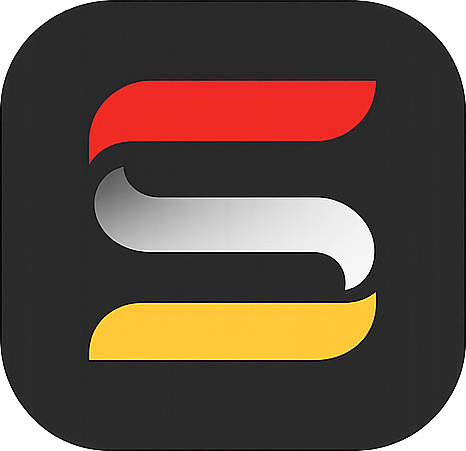
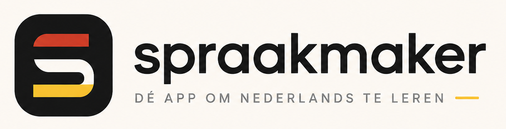

# Spraakmaker 🇳🇱

**Spraakmaker** is an interactive, gamified, and modern web application designed for learning the Dutch language. Built with Next.js, Framer Motion, and Tailwind CSS, it offers a rich and responsive learning experience tailored to help users learn grammar, expand vocabulary, and practice building sentences.

🌐 **Live URL:** [spraakmaker.fun](https://spraakmaker.fun)

---

## ✨ Features

### 📖 Interactive Lessons (`Lessen`)
* Structured lessons categorized by modules.
* **Phase-based Learning:**
  1. **Lezen (Reading):** Read engaging stories with clickable vocabulary translation popups.
  2. **Herhaling (Review):** Consolidate newly learned words.
  3. **Egzersizler (Exercises):** Grammar and structure drills.

### 🗂 Spaced Repetition Vocabulary Builder (`Woordkaarten`)
* **SM2 Spaced Repetition Algorithm:** Smart scheduling of cards based on review scores.
* Filter cards by lesson groups: `ALLE` (All), `TC1-2`, `CODE+`, `INZICHT`, and `WW` (Verbs).
* Interactive flip cards flanking clean navigation arrows and session score badges (`Faut` / `Goed`).

### 🎮 Gamified Learning Modules (`Spellen`)
* **Zin Bouwen:** Form correct sentences by dragging and dropping words.
* **Vul In:** Grammar drills with fill-in-the-blanks challenges.
* **Snelronde (Speed Round):** A fast-paced vocabulary test against the clock.
* **Zin Motor:** Build sentences step-by-step using grammatical building blocks.
* **Flitsen:** Rapid pronunciation and listening challenge with built-in timers.
* **Voegwoorden & Signaalwoorden:** Targeted practice for conjunctions and signposts.
* **Werkwoorden:** Verb conjugation trainer.

### 🌐 Smart Immersion Mode (B1 & B2 Level)
* Users selecting intermediate/advanced levels (B1/B2) get **immersion learning** where Turkish translation helpers are hidden behind a `[toon vertaling]` button to encourage thinking in Dutch.

### 🎨 Harmonious UI Themes
* **Modern UI:** Sleek glassmorphic styles, rounded corners, responsive layout fitting perfectly on mobile viewports, and custom slate navy & turquoise color palettes.
* **De Stijl (Mondriaan) UI:** A retro, bold primary color layout inspired by Piet Mondrian's minimalist art style.

---

## 🛠 Tech Stack

* **Framework:** Next.js 15 (App Router)
* **Language:** TypeScript
* **Styling:** Tailwind CSS, Vanilla CSS custom variables (`globals.css`)
* **Animations:** Framer Motion
* **Storage:** LocalStorage (for tracking study progress, stats, and high scores offline)

---

## 🚀 Getting Started

To run the project locally:

### 1. Clone the repository
```bash
git clone https://github.com/yakupnuri/spraakmaker.git
cd spraakmaker
```

### 2. Install dependencies
```bash
npm install
```

### 3. Run the development server
```bash
npm run dev
```

Open [http://localhost:3000](http://localhost:3000) in your browser to start studying!

---

## 📸 Screenshots & Demos

| Modern Dashboard | Spaced Repetition Cards | Drag & Drop Game |
|:---:|:---:|:---:|
|  |  |  |

---

## 📝 License

This project is open-source and available under the [MIT License](LICENSE).
